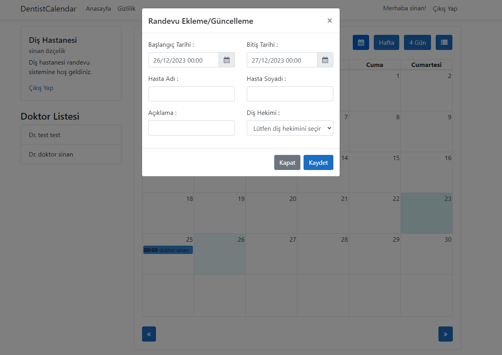

<div align="center">
  
</div>

##  About The Project

In this project, the focus is on the effective use of the FullCalendar library. In addition, the Dental Hospital Appointment Information System, developed using .Net Core 3.1 MVC, provides the opportunity to practice how to use FullCalendar in projects.

In this project, an approach has been adopted in which, in addition to theoretical knowledge, each concept is put into practice and the most accurate usage methods are shared. You can use this documentation to understand how to use FullCalendar in projects and gain the necessary skills to develop your project. Hope it is useful, good luck!

```html
<!-- HTML Meta Tags -->
<meta charset="UTF-8">
<meta name="viewport" content="width=device-width, initial-scale=1, maximum-scale=1">
<meta name="author" content="Sinan Özçelik">
<meta name="publisher" content="VS 2023">
<!-- Web Site Title -->
<title>FullCalendar .Net Core MVC Appointment System Project</title>
<!-- Meta Open Graph -->
<meta property="og:locale" content="en_US" />
<meta property="og:type" content="website" />
<meta property="og:title" content="Homepage" />
<meta property="og:url" content="FullCalendar .Net Core MVC Appointment System Project" />
<meta property="og:site_name" content="FullCalendar .Net Core MVC Appointment System Project" />
```

##  Features

- [x] Calendar Integration
- [x] Using Javascript, Jquery and Ajax
- [x] .Net Core 3.1 MVC
- [x] CRUD Operations
- [x] Entity Framework
- [x] Migrations
- [x] .Net Core Identity
- [x] Scaffolding

##  Build With


##  Installation

1. Check the database connection on the appsetting.json file. Customize the database connection path here according to your own computer. By default the database name is DentistDB.

   ```json
   {
      "ConnectionStrings": {
         "DefaultConnection": "Server=localhost\\sqlexpress; Database=DentistDB; Integrated Security=True;"
      },
      "Logging": {
         "LogLevel": {
            "Default": "Information",
            "Microsoft": "Warning",
            "Microsoft.Hosting.Lifetime": "Information"
         }
      },
      "AllowedHosts": "*"
      }
   ```
2. Type the add-migration command via the Package Manager Console.
   
   ```
   add-migration DbCreateFirst
   ```
3. After the migration process is completed, type update-database via the Package Manager Console.
   
   ```
   update-database
   ```

## 💻 Project View




##  Contact Information

You can reach out to me using the following contact details:

[](mailto:info@sinanozcelik.com)

[](https://sinanozcelik.com)

I'm always open to development and collaboration. Feel free to reach out to me!